# Comparative Analysis of the determinants of Economic growth in WAEMU and BRICS Countries from 2005 to 2018

**Performed by :**

-   GOMEZ Jean-Baptiste Boris
-   MOUSSA DJIBO Nabil
-   LAKSIBI Safae

This document presents a comparative analysis of the determinants of economic growth between two groups of countries which both experienced recession in 1980. The database was created using data from the World Bank website. After showing the growth gap between WAEMU countries and BRICS countries, we performed a **Im-Pesaran-Shin stationarity Test** to verify the stationarity of each of our variables. Then, after estimating the model and carrying out the **Hausman-Taylor Test**, we retained the Within model, i.e. the fixed effects model for the WAEMU countries and the error component model or random effects model for the BRICS countries. Finally, we performed the **Breush-Pagan heteroskedasticity test** and the **Durbin-Watson and Breusch-Godfrey/Wooldridge Autocorrelation of Error term test**.

## 1. Importing and Preparing Data

### 1.1 WAEMU Countries

Creation of the database of WAEMU countries The dataset is a database with many columns, so we use `pivot longer` to reduce the number of columns and have many rows. The degree of openness indicates the country's dependence on the outside and the place that the rest of the world holds in a country's economy. The formula for calculating the degree of trade openness is as follows: DO = [(Exports + Imports) / 2] / GDP) x 100.


```r
library(foreign)
library(readxl)
library(dplyr)
library(tidyr)
library(ggplot2)
library(plotly)
library(plm)
library(stargazer)
library(car)
library(lmtest)

setwd("C:/Users/gomez/OneDrive/Documents/r STUDIO MASTER1/Project_R_M1/Databases")

######### Public expenses #############

data_DP <- read_excel("Depenses_publiques.xls", sheet = "Data", skip = 3) 
data_DP <- data_DP[,-3:-24]
names(data_DP)[1:2]<-c("Country_Name","Country_Code")
row_data_DP_UEMOA<- c("Bénin","Burkina Faso","Côte d'Ivoire","Guinée-Bissau","Mali","Niger","Sénégal","Togo")
data_DP_UEMOA<- data_DP[data_DP$Country_Name %in% row_data_DP_UEMOA,]
BenData_uemoa = data_DP_UEMOA[1,]
Depubdata <- BenData_uemoa %>% pivot_longer(c(3:ncol(data_DP_UEMOA)),names_to = "Year", values_to = "DEPUB")
tempdf = data.frame()
i=2
while (i<= nrow(data_DP_UEMOA) ) {
  tempdf<-data_DP_UEMOA[i,]
  tempdf<-tempdf %>% pivot_longer(c(3:ncol(data_DP_UEMOA)),names_to = "Year", values_to = "DEPUB")
  Depubdata <- rbind.data.frame(Depubdata,tempdf)
  i<-i+1
}

######### External Debts ###########

data_DEBTEXT <- read_excel("Dette_exterieur.xls", sheet = "Data", skip = 3) 
data_DEBTEXT <- data_DEBTEXT[,-3:-24]
names(data_DEBTEXT)[1:2]<-c("Country_Name","Country_Code")
row_data_DEBTEXT_UEMOA<- c("Bénin","Burkina Faso","Côte d'Ivoire","Guinée-Bissau","Mali","Niger","Sénégal","Togo")
data_DEBTEXT_UEMOA<- data_DEBTEXT[data_DEBTEXT$Country_Name %in% row_data_DEBTEXT_UEMOA,]
BenData_uemoa = data_DEBTEXT_UEMOA[1,]
Dettdata <- BenData_uemoa %>% pivot_longer(c(3:ncol(data_DEBTEXT_UEMOA)),names_to = "Year", values_to = "DEBTEXT") 
tempdf = data.frame()
i=2
while (i<= nrow(data_DEBTEXT_UEMOA) ) {
  tempdf<-data_DEBTEXT_UEMOA[i,]
  tempdf<-tempdf %>% pivot_longer(c(3:ncol(data_DEBTEXT_UEMOA)),names_to = "Year", values_to = "DEBTEXT")
  Dettdata <- rbind.data.frame(Dettdata,tempdf)
  i<-i+1
}

######### Gross savings ##############
data_Epar <- read_excel("epargne_brute.xls", sheet = "Data", skip = 3) 
data_Epar <- data_Epar[,-3:-24]
names(data_Epar)[1:2]<-c("Country_Name","Country_Code")
row_data_Epar_UEMOA<- c("Bénin","Burkina Faso","Côte d'Ivoire","Guinée-Bissau","Mali","Niger","Sénégal","Togo")
data_Epar_UEMOA<- data_Epar[data_Epar$Country_Name %in% row_data_Epar_UEMOA,]
BenData_uemoa = data_Epar_UEMOA[1,]
Epardata <- BenData_uemoa %>% pivot_longer(c(3:ncol(data_Epar_UEMOA)),names_to = "Year", values_to = "EPARBRUT") 
tempdf = data.frame()
i=2
while (i<= nrow(data_Epar_UEMOA) ) {
  tempdf<-data_Epar_UEMOA[i,]
  tempdf<-tempdf %>% pivot_longer(c(3:ncol(data_Epar_UEMOA)),names_to = "Year", values_to = "EPARBRUT")
  Epardata <- rbind.data.frame(Epardata,tempdf)
  i<-i+1
}

######### GDP per capita ##############

data_GDPH <- read_excel("GDPperHabitat.xls", sheet = "Data", skip = 3) 
data_GDPH <- data_GDPH[,-3:-24]
names(data_GDPH)[1:2]<-c("Country_Name","Country_Code")
row_data_GDPH_UEMOA<- c("Bénin","Burkina Faso","Côte d'Ivoire","Guinée-Bissau","Mali","Niger","Sénégal","Togo")
data_GDPH_UEMOA<- data_GDPH[data_GDPH$Country_Name %in% row_data_GDPH_UEMOA,]
BenData_uemoa = data_GDPH_UEMOA[1,]
GDPHdata <- BenData_uemoa %>% pivot_longer(c(3:ncol(data_GDPH_UEMOA)),names_to = "Year", values_to = "GDP_Habitat") 
tempdf = data.frame()
i=2
while (i<= nrow(data_GDPH_UEMOA) ) {
  tempdf<-data_GDPH_UEMOA[i,]
  tempdf<-tempdf %>% pivot_longer(c(3:ncol(data_GDPH_UEMOA)),names_to = "Year", values_to = "GDP_Habitat")
  GDPHdata <- rbind.data.frame(GDPHdata,tempdf)
  i<-i+1
}

######### Inflation in % GDP ##############

data_INFLA <- read_excel("inflation_deflateur_PIB.xls", sheet = "Data", skip = 3) 
data_INFLA <- data_INFLA[,-3:-24]
names(data_INFLA)[1:2]<-c("Country_Name","Country_Code")
row_data_INFLA_UEMOA<- c("Bénin","Burkina Faso","Côte d'Ivoire","Guinée-Bissau","Mali","Niger","Sénégal","Togo")
data_INFLA_UEMOA<- data_INFLA[data_INFLA$Country_Name %in% row_data_INFLA_UEMOA,]
BenData_uemoa = data_INFLA_UEMOA[1,]
INFLAdata <- BenData_uemoa %>% pivot_longer(c(3:ncol(data_INFLA_UEMOA)),names_to = "Year", values_to = "Inflation") 
tempdf = data.frame()
i=2
while (i<= nrow(data_INFLA_UEMOA) ) {
  tempdf<-data_INFLA_UEMOA[i,]
  tempdf<-tempdf %>% pivot_longer(c(3:ncol(data_INFLA_UEMOA)),names_to = "Year", values_to = "Inflation")
  INFLAdata <- rbind.data.frame(INFLAdata,tempdf)
  i<-i+1
}

######### Private investment ################

data_INVPR <- read_excel("Investissement_privée(FBCF).xls", sheet = "Data", skip = 3) 
data_INVPR <- data_INVPR[,-3:-24]
names(data_INVPR)[1:2]<-c("Country_Name","Country_Code")
row_data_INVPR_UEMOA<- c("Bénin","Burkina Faso","Côte d'Ivoire","Guinée-Bissau","Mali","Niger","Sénégal","Togo")
data_INVPR_UEMOA<- data_INVPR[data_INVPR$Country_Name %in% row_data_INVPR_UEMOA,]
BenData_uemoa = data_INVPR_UEMOA[1,]
INVPRdata <- BenData_uemoa %>% pivot_longer(c(3:ncol(data_INVPR_UEMOA)),names_to = "Year", values_to = "INPRIV") 
tempdf = data.frame()
i=2
while (i<= nrow(data_INVPR_UEMOA) ) {
  tempdf<-data_INVPR_UEMOA[i,]
  tempdf<-tempdf %>% pivot_longer(c(3:ncol(data_INVPR_UEMOA)),names_to = "Year", values_to = "INPRIV")
  INVPRdata <- rbind.data.frame(INVPRdata,tempdf)
  i<-i+1
}

######### Labour force ###############

data_POPACT <- read_excel("population_active.xls", sheet = "Data", skip = 3) 
data_POPACT <- data_POPACT[,-3:-24]
names(data_POPACT)[1:2]<-c("Country_Name","Country_Code")
row_data_POPACT_UEMOA<- c("Bénin","Burkina Faso","Côte d'Ivoire","Guinée-Bissau","Mali","Niger","Sénégal","Togo")
data_POPACT_UEMOA<- data_POPACT[data_POPACT$Country_Name %in% row_data_POPACT_UEMOA,]
BenData_uemoa = data_POPACT_UEMOA[1,]
POPACTdata <- BenData_uemoa %>% pivot_longer(c(3:ncol(data_POPACT_UEMOA)),names_to = "Year", values_to = "POP_ACT") 
tempdf = data.frame()
i=2
while (i<= nrow(data_POPACT_UEMOA) ) {
  tempdf<-data_POPACT_UEMOA[i,]
  tempdf<-tempdf %>% pivot_longer(c(3:ncol(data_POPACT_UEMOA)),names_to = "Year", values_to = "POP_ACT")
  POPACTdata <- rbind.data.frame(POPACTdata,tempdf)
  i<-i+1
}

######### Export of goods and services in GDP % ################

data_EXPIB <- read_excel("Exportation_de_bien_et_services_pourcentage_PIB.xls", sheet = "Data", skip = 3) 
data_EXPIB <- data_EXPIB[,-3:-24]
names(data_EXPIB)[1:2]<-c("Country_Name","Country_Code")
row_data_EXPIB_UEMOA<- c("Bénin","Burkina Faso","Côte d'Ivoire","Guinée-Bissau","Mali","Niger","Sénégal","Togo")
data_EXPIB_UEMOA<- data_EXPIB[data_EXPIB$Country_Name %in% row_data_EXPIB_UEMOA,]
BenData_uemoa = data_EXPIB_UEMOA[1,]
EXPIBdata <- BenData_uemoa %>% pivot_longer(c(3:ncol(data_EXPIB_UEMOA)),names_to = "Year", values_to = "EXP_PIB") 
tempdf = data.frame()
i=2
while (i<= nrow(data_EXPIB_UEMOA) ) {
  tempdf<-data_EXPIB_UEMOA[i,]
  tempdf<-tempdf %>% pivot_longer(c(3:ncol(data_EXPIB_UEMOA)),names_to = "Year", values_to = "EXP_PIB")
  EXPIBdata <- rbind.data.frame(EXPIBdata,tempdf)
  i<-i+1
}

######### Import of goods and services in GDP % ################

data_IMPIB <- read_excel("importation_des_biens_et_services_pourcentage_PIB.xls", sheet = "Data", skip = 3) 
data_IMPIB <- data_IMPIB[,-3:-24]
names(data_IMPIB)[1:2]<-c("Country_Name","Country_Code")
row_data_IMPIB_UEMOA<- c("Bénin","Burkina Faso","Côte d'Ivoire","Guinée-Bissau","Mali","Niger","Sénégal","Togo")
data_IMPIB_UEMOA<- data_IMPIB[data_IMPIB$Country_Name %in% row_data_IMPIB_UEMOA,]
BenData_uemoa = data_IMPIB_UEMOA[1,]
IMPIBdata <- BenData_uemoa %>% pivot_longer(c(3:ncol(data_IMPIB_UEMOA)),names_to = "Year", values_to = "IMP_PIB") 
tempdf = data.frame()
i=2
while (i<= nrow(data_IMPIB_UEMOA) ) {
  tempdf<-data_IMPIB_UEMOA[i,]
  tempdf<-tempdf %>% pivot_longer(c(3:ncol(data_IMPIB_UEMOA)),names_to = "Year", values_to = "IMP_PIB")
  IMPIBdata <- rbind.data.frame(IMPIBdata,tempdf)
  i<-i+1
}
############## The degree of openness #####################

OCdata <- cbind.data.frame(IMPIBdata, EXPIBdata[,ncol(EXPIBdata)])
OCdata[is.na(OCdata)] <- 0 # replace na  0 
OCdata$OUVCM <- (OCdata$IMP_PIB + OCdata$EXP_PIB)/2

# Merging dataset

Data_UEMOA <- cbind.data.frame(GDPHdata, POPACTdata[,ncol(POPACTdata)], INVPRdata[,ncol(INVPRdata)],
                               Epardata[,ncol(Epardata)], Dettdata[,ncol(Dettdata)], Depubdata[,ncol(Depubdata)],
                               OCdata["OUVCM"], INFLAdata[,ncol(INFLAdata)])

# Balanced panel data (2005 - 2018 without CIV) and without 2010 because Guinée-Bissau at negative value of brut saving irrelevant for log 

Data_UEMOA <- Data_UEMOA[Data_UEMOA$Country_Code != "CIV",]
Data_UEMOA <- Data_UEMOA[Data_UEMOA$Year %in% c(2005,2006,2007,2008,2009,2011,2012,2013,2014,2015,2016,2017,2018),]
Data_UEMOA <- Data_UEMOA %>% mutate_at(c('GDP_Habitat', 'POP_ACT', 'INPRIV', 'EPARBRUT', 'DEBTEXT', 'DEPUB', 'OUVCM', 'Inflation'), as.numeric)
Data_UEMOA$Code = as.factor(ifelse(Data_UEMOA$Country_Name == "Bénin",1,
                                   ifelse(Data_UEMOA$Country_Name == "Burkina Faso", 2,
                                          ifelse(Data_UEMOA$Country_Name == "Guinée-Bissau", 3,
                                                 ifelse(Data_UEMOA$Country_Name == "Mali", 4,
                                                        ifelse(Data_UEMOA$Country_Name == "Niger", 5,
                                                               ifelse(Data_UEMOA$Country_Name == "Sénégal", 6,7
                                                                            )))))))
Data_UEMOA %>% relocate(c("Code","Year"), .before = Country_Name) -> Data_UEMOA
Data_UEMOA <- as_tibble(Data_UEMOA)
Data_UEMOA
```

```
## # A tibble: 91 × 12
##    Code  Year  Country_N…¹ Count…² GDP_H…³ POP_ACT INPRIV EPARB…⁴ DEBTEXT  DEPUB
##    <fct> <chr> <chr>       <chr>     <dbl>   <dbl>  <dbl>   <dbl>   <dbl>  <dbl>
##  1 1     2005  Bénin       BEN        823. 3184049 7.94e8  8.01e8  1.56e9 5.91e8
##  2 1     2006  Bénin       BEN        856. 3282301 9.06e8  8.77e8  6.60e8 6.80e8
##  3 1     2007  Bénin       BEN        966. 3383679 1.34e9  1.15e9  9.03e8 7.82e8
##  4 1     2008  Bénin       BEN       1125. 3488763 1.34e9  1.24e9  9.98e8 1.00e9
##  5 1     2009  Bénin       BEN       1089. 3598159 1.45e9  1.12e9  1.33e9 1.10e9
##  6 1     2011  Bénin       BEN       1130. 3825604 1.76e9  1.30e9  1.86e9 1.18e9
##  7 1     2012  Bénin       BEN       1145. 3942161 1.70e9  1.51e9  1.67e9 1.24e9
##  8 1     2013  Bénin       BEN       1251. 4063769 2.36e9  2.04e9  2.00e9 1.38e9
##  9 1     2014  Bénin       BEN       1291. 4189856 2.56e9  2.47e9  2.04e9 1.35e9
## 10 1     2015  Bénin       BEN       1077. 4320200 2.36e9  1.58e9  2.17e9 1.30e9
## # … with 81 more rows, 2 more variables: OUVCM <dbl>, Inflation <dbl>, and
## #   abbreviated variable names ¹​Country_Name, ²​Country_Code, ³​GDP_Habitat,
## #   ⁴​EPARBRUT
```

### 1.2 BRICS Countries

We do the same things for BRICS countries.


```r
setwd("C:/Users/gomez/OneDrive/Documents/r STUDIO MASTER1/Project_R_M1/Databases")
######### Public expenses #############

data_DP <- read_excel("Depenses_publiques.xls", sheet = "Data", skip = 3) 
data_DP <- data_DP[,-3:-24]
names(data_DP)[1:2]<-c("Country_Name","Country_Code")
row_data_DP_BRICS<- c("Brésil","Fédération de Russie","Inde","Chine","Afrique du Sud")
data_DP_BRICS<- data_DP[data_DP$Country_Name %in% row_data_DP_BRICS,]
BenData_BRICS = data_DP_BRICS[1,]
Depubdata <- BenData_BRICS %>% pivot_longer(c(3:ncol(data_DP_BRICS)),names_to = "Year", values_to = "DEPUB") #gather(Year, DEPUB, 4:10)
tempdf = data.frame()
i=2
while (i<= nrow(data_DP_BRICS) ) {
  tempdf<-data_DP_BRICS[i,]
  tempdf<-tempdf %>% pivot_longer(c(3:ncol(data_DP_BRICS)),names_to = "Year", values_to = "DEPUB")
  Depubdata <- rbind.data.frame(Depubdata,tempdf)
  i<-i+1
}

######### External Debts ###########

data_DEBTEXT <- read_excel("Dette_exterieur.xls", sheet = "Data", skip = 3) 
data_DEBTEXT <- data_DEBTEXT[,-3:-24]
names(data_DEBTEXT)[1:2]<-c("Country_Name","Country_Code")
row_data_DEBTEXT_BRICS<- c("Brésil","Fédération de Russie","Inde","Chine","Afrique du Sud")
data_DEBTEXT_BRICS<- data_DEBTEXT[data_DEBTEXT$Country_Name %in% row_data_DEBTEXT_BRICS,]
BenData_BRICS = data_DEBTEXT_BRICS[1,]
Dettdata <- BenData_BRICS %>% pivot_longer(c(3:ncol(data_DEBTEXT_BRICS)),names_to = "Year", values_to = "DEBTEXT") 
tempdf = data.frame()
i=2
while (i<= nrow(data_DEBTEXT_BRICS) ) {
  tempdf<-data_DEBTEXT_BRICS[i,]
  tempdf<-tempdf %>% pivot_longer(c(3:ncol(data_DEBTEXT_BRICS)),names_to = "Year", values_to = "DEBTEXT")
  Dettdata <- rbind.data.frame(Dettdata,tempdf)
  i<-i+1
}

######### Gross savings ##############

data_Epar <- read_excel("epargne_brute.xls", sheet = "Data", skip = 3) 
data_Epar <- data_Epar[,-3:-24]
names(data_Epar)[1:2]<-c("Country_Name","Country_Code")
row_data_Epar_BRICS<- c("Brésil","Fédération de Russie","Inde","Chine","Afrique du Sud")
data_Epar_BRICS<- data_Epar[data_Epar$Country_Name %in% row_data_Epar_BRICS,]
BenData_BRICS = data_Epar_BRICS[1,]
Epardata <- BenData_BRICS %>% pivot_longer(c(3:ncol(data_Epar_BRICS)),names_to = "Year", values_to = "EPARBRUT") 
tempdf = data.frame()
i=2
while (i<= nrow(data_Epar_BRICS) ) {
  tempdf<-data_Epar_BRICS[i,]
  tempdf<-tempdf %>% pivot_longer(c(3:ncol(data_Epar_BRICS)),names_to = "Year", values_to = "EPARBRUT")
  Epardata <- rbind.data.frame(Epardata,tempdf)
  i<-i+1
}

######### GDP per capita ##############

data_GDPH <- read_excel("GDPperHabitat.xls", sheet = "Data", skip = 3) 
data_GDPH <- data_GDPH[,-3:-24]
names(data_GDPH)[1:2]<-c("Country_Name","Country_Code")
row_data_GDPH_BRICS<- c("Brésil","Fédération de Russie","Inde","Chine","Afrique du Sud")
data_GDPH_BRICS<- data_GDPH[data_GDPH$Country_Name %in% row_data_GDPH_BRICS,]
BenData_BRICS = data_GDPH_BRICS[1,]
GDPHdata <- BenData_BRICS %>% pivot_longer(c(3:ncol(data_GDPH_BRICS)),names_to = "Year", values_to = "GDP_Habitat") 
tempdf = data.frame()
i=2
while (i<= nrow(data_GDPH_BRICS) ) {
  tempdf<-data_GDPH_BRICS[i,]
  tempdf<-tempdf %>% pivot_longer(c(3:ncol(data_GDPH_BRICS)),names_to = "Year", values_to = "GDP_Habitat")
  GDPHdata <- rbind.data.frame(GDPHdata,tempdf)
  i<-i+1
}

######### Inflation in % GDP ##############

data_INFLA <- read_excel("inflation_deflateur_PIB.xls", sheet = "Data", skip = 3) 
data_INFLA <- data_INFLA[,-3:-24]
names(data_INFLA)[1:2]<-c("Country_Name","Country_Code")
row_data_INFLA_BRICS<- c("Brésil","Fédération de Russie","Inde","Chine","Afrique du Sud")
data_INFLA_BRICS<- data_INFLA[data_INFLA$Country_Name %in% row_data_INFLA_BRICS,]
BenData_BRICS = data_INFLA_BRICS[1,]
INFLAdata <- BenData_BRICS %>% pivot_longer(c(3:ncol(data_INFLA_BRICS)),names_to = "Year", values_to = "Inflation") 
tempdf = data.frame()
i=2
while (i<= nrow(data_INFLA_BRICS) ) {
  tempdf<-data_INFLA_BRICS[i,]
  tempdf<-tempdf %>% pivot_longer(c(3:ncol(data_INFLA_BRICS)),names_to = "Year", values_to = "Inflation")
  INFLAdata <- rbind.data.frame(INFLAdata,tempdf)
  i<-i+1
}

######### Private investment ################

data_INVPR <- read_excel("Investissement_privée(FBCF).xls", sheet = "Data", skip = 3) 
data_INVPR <- data_INVPR[,-3:-24]
names(data_INVPR)[1:2]<-c("Country_Name","Country_Code")
row_data_INVPR_BRICS<- c("Brésil","Fédération de Russie","Inde","Chine","Afrique du Sud")
data_INVPR_BRICS<- data_INVPR[data_INVPR$Country_Name %in% row_data_INVPR_BRICS,]
BenData_BRICS = data_INVPR_BRICS[1,]
INVPRdata <- BenData_BRICS %>% pivot_longer(c(3:ncol(data_INVPR_BRICS)),names_to = "Year", values_to = "INPRIV") 
tempdf = data.frame()
i=2
while (i<= nrow(data_INVPR_BRICS) ) {
  tempdf<-data_INVPR_BRICS[i,]
  tempdf<-tempdf %>% pivot_longer(c(3:ncol(data_INVPR_BRICS)),names_to = "Year", values_to = "INPRIV")
  INVPRdata <- rbind.data.frame(INVPRdata,tempdf)
  i<-i+1
}

######### Labour force ###############

data_POPACT <- read_excel("population_active.xls", sheet = "Data", skip = 3) 
data_POPACT <- data_POPACT[,-3:-24]
names(data_POPACT)[1:2]<-c("Country_Name","Country_Code")
row_data_POPACT_BRICS<- c("Brésil","Fédération de Russie","Inde","Chine","Afrique du Sud")
data_POPACT_BRICS<- data_POPACT[data_POPACT$Country_Name %in% row_data_POPACT_BRICS,]
BenData_BRICS = data_POPACT_BRICS[1,]
POPACTdata <- BenData_BRICS %>% pivot_longer(c(3:ncol(data_POPACT_BRICS)),names_to = "Year", values_to = "POP_ACT") 
tempdf = data.frame()
i=2
while (i<= nrow(data_POPACT_BRICS) ) {
  tempdf<-data_POPACT_BRICS[i,]
  tempdf<-tempdf %>% pivot_longer(c(3:ncol(data_POPACT_BRICS)),names_to = "Year", values_to = "POP_ACT")
  POPACTdata <- rbind.data.frame(POPACTdata,tempdf)
  i<-i+1
}

######### Export of goods and services in GDP % ################

data_EXPIB <- read_excel("Exportation_de_bien_et_services_pourcentage_PIB.xls", sheet = "Data", skip = 3) 
data_EXPIB <- data_EXPIB[,-3:-24]
names(data_EXPIB)[1:2]<-c("Country_Name","Country_Code")
row_data_EXPIB_BRICS<- c("Brésil","Fédération de Russie","Inde","Chine","Afrique du Sud")
data_EXPIB_BRICS<- data_EXPIB[data_EXPIB$Country_Name %in% row_data_EXPIB_BRICS,]
BenData_BRICS = data_EXPIB_BRICS[1,]
EXPIBdata <- BenData_BRICS %>% pivot_longer(c(3:ncol(data_EXPIB_BRICS)),names_to = "Year", values_to = "EXP_PIB") 
tempdf = data.frame()
i=2
while (i<= nrow(data_EXPIB_BRICS) ) {
  tempdf<-data_EXPIB_BRICS[i,]
  tempdf<-tempdf %>% pivot_longer(c(3:ncol(data_EXPIB_BRICS)),names_to = "Year", values_to = "EXP_PIB")
  EXPIBdata <- rbind.data.frame(EXPIBdata,tempdf)
  i<-i+1
}

######### Import of goods and services in GDP % ################

data_IMPIB <- read_excel("importation_des_biens_et_services_pourcentage_PIB.xls", sheet = "Data", skip = 3) 
data_IMPIB <- data_IMPIB[,-3:-24]
names(data_IMPIB)[1:2]<-c("Country_Name","Country_Code")
row_data_IMPIB_BRICS<- c("Brésil","Fédération de Russie","Inde","Chine","Afrique du Sud")
data_IMPIB_BRICS<- data_IMPIB[data_IMPIB$Country_Name %in% row_data_IMPIB_BRICS,]
BenData_BRICS = data_IMPIB_BRICS[1,]
IMPIBdata <- BenData_BRICS %>% pivot_longer(c(3:ncol(data_IMPIB_BRICS)),names_to = "Year", values_to = "IMP_PIB") 
tempdf = data.frame()
i=2
while (i<= nrow(data_IMPIB_BRICS) ) {
  tempdf<-data_IMPIB_BRICS[i,]
  tempdf<-tempdf %>% pivot_longer(c(3:ncol(data_IMPIB_BRICS)),names_to = "Year", values_to = "IMP_PIB")
  IMPIBdata <- rbind.data.frame(IMPIBdata,tempdf)
  i<-i+1
}

############## The degree of openness #####################

OCdata <- cbind.data.frame(IMPIBdata, EXPIBdata[,ncol(EXPIBdata)])
OCdata[is.na(OCdata)] <- 0 # replace NA to  0 
OCdata$OUVCM <- (OCdata$IMP_PIB + OCdata$EXP_PIB)/2

# Merging databases

Data_BRICS <- cbind.data.frame(GDPHdata, POPACTdata[,ncol(POPACTdata)], INVPRdata[,ncol(INVPRdata)],
                               Epardata[,ncol(Epardata)], Dettdata[,ncol(Dettdata)], Depubdata[,ncol(Depubdata)],
                               OCdata["OUVCM"], INFLAdata[,ncol(INFLAdata)])

# Balanced panel data (2005 - 2018 without CIV) and without 2010 because Guinée-Bissau at negative value of brut saving irrelevant for log 

Data_BRICS <- Data_BRICS[Data_BRICS$Country_Code != "CIV",]
Data_BRICS <- Data_BRICS[Data_BRICS$Year %in% c(2005,2006,2007,2008,2009,2011,2012,2013,2014,2015,2016,2017,2018),]
Data_BRICS <- Data_BRICS %>% mutate_at(c('GDP_Habitat', 'POP_ACT', 'INPRIV', 'EPARBRUT', 'DEBTEXT', 'DEPUB', 'OUVCM', 'Inflation'), as.numeric)
Data_BRICS$Code = as.factor(ifelse(Data_BRICS$Country_Name == "Afrique du Sud",1,
                                   ifelse(Data_BRICS$Country_Name == "Brésil", 2,
                                          ifelse(Data_BRICS$Country_Name == "Chine", 3,
                                                 ifelse(Data_BRICS$Country_Name == "Fédération de Russie", 4,5
                                                       )))))
Data_BRICS %>% relocate(c("Code","Year"), .before = Country_Name) -> Data_BRICS
Data_BRICS <- as_tibble(Data_BRICS)
Data_BRICS
```

```
## # A tibble: 65 × 12
##    Code  Year  Country…¹ Count…² GDP_H…³ POP_ACT  INPRIV EPARB…⁴ DEBTEXT   DEPUB
##    <fct> <chr> <chr>     <chr>     <dbl>   <dbl>   <dbl>   <dbl>   <dbl>   <dbl>
##  1 2     2005  Brésil    BRA       4790.  8.89e7 1.53e11 1.62e11 1.88e11 1.68e11
##  2 2     2006  Brésil    BRA       5886.  9.00e7 1.97e11 2.05e11 1.94e11 2.11e11
##  3 2     2007  Brésil    BRA       7348.  9.11e7 2.77e11 2.71e11 2.38e11 2.65e11
##  4 2     2008  Brésil    BRA       8831.  9.24e7 3.67e11 3.26e11 2.63e11 3.19e11
##  5 2     2009  Brésil    BRA       8598.  9.42e7 3.13e11 2.75e11 2.82e11 3.28e11
##  6 2     2011  Brésil    BRA      13245.  9.38e7 5.71e11 4.84e11 4.04e11 4.88e11
##  7 2     2012  Brésil    BRA      12370.  9.49e7 5.28e11 4.33e11 4.41e11 4.57e11
##  8 2     2013  Brésil    BRA      12300.  9.61e7 5.36e11 4.46e11 4.84e11 4.67e11
##  9 2     2014  Brésil    BRA      12113.  9.72e7 5.05e11 3.93e11 5.57e11 4.70e11
## 10 2     2015  Brésil    BRA       8814.  9.87e7 3.14e11 2.58e11 5.43e11 3.56e11
## # … with 55 more rows, 2 more variables: OUVCM <dbl>, Inflation <dbl>, and
## #   abbreviated variable names ¹​Country_Name, ²​Country_Code, ³​GDP_Habitat,
## #   ⁴​EPARBRUT
```

## 2. Features of two Panels Databases

As we can see below our two databases are balanced panels. Concerning the characteristics of our two databases :

    | Countries Groups   | Number of individuals | Number of observations | Times series |
    |------------------- |:---------------------:|:----------------------:|-------------:|
    |        WAEMU       |           7           |           91           |      13      |
    |        BRICS       |           5           |           65           |      13      |


```r
Data_UEMOA <- pdata.frame(Data_UEMOA, index = c("Country_Name", "Year"))
Data_UEMOA  %>%  is.pbalanced()
```

```
## [1] TRUE
```

```r
Data_BRICS <- pdata.frame(Data_BRICS, index = c("Country_Name", "Year"))
Data_BRICS  %>%  is.pbalanced()
```

```
## [1] TRUE
```

```r
pdim(Data_UEMOA)
```

```
## Balanced Panel: n = 7, T = 13, N = 91
```

```r
pdim(Data_BRICS)
```

```
## Balanced Panel: n = 5, T = 13, N = 65
```

## 3. Comparing economic growth with GDP per capita between the two groups of countries by year


```r
df1 <- Data_UEMOA %>%
  group_by(Year) %>%
  summarise_at(vars(GDP_Habitat), list(Mean_GDPH = mean))

df2 <- Data_BRICS %>%
  group_by(Year) %>%
  summarise_at(vars(GDP_Habitat), list(Mean_GDPH = mean))

df1$Group_Name <- rep("WAEMU", times = nrow(df1))
df2$Group_Name <- rep("BRICS", times = nrow(df2))
Data_graph <- rbind(df1,df2)

ggplotly(ggplot(Data_graph,aes(x = Year, y =Mean_GDPH, fill = Group_Name)) + 
           geom_bar(stat = "identity", position = "dodge") + 
           scale_y_log10(expand = expansion(mult = c(0, 0.10))) + 
           scale_fill_manual(values=c("blue", "darkgreen")) +
           theme(panel.border = element_rect(linetype = "dashed", fill = NA)) +
           labs(x="Year",y="Mean GDP per Capita", caption = "Data source: World Bank data (2022).")+
           theme(legend.background = element_rect(fill="lightgray", 
                                                  size=0.3, linetype="solid"))+
           theme(legend.title = element_text(face = "bold"))+
           theme(plot.title = element_text(size = 8, face = "bold")) +
           ggtitle("Evolution of average GDP per capita (in dollars) in WAEMU and BRICS countries between 2005 and 2018"))
```

```{=html}
<div class="plotly html-widget html-fill-item-overflow-hidden html-fill-item" id="htmlwidget-0c024a7f2f8a65b9fdfa" style="width:816px;height:480px;"></div>
<script type="application/json" data-for="htmlwidget-0c024a7f2f8a65b9fdfa">{"x":{"data":[{"orientation":"v","width":[0.45,0.45,0.45,0.45,0.449999999999999,0.449999999999999,0.449999999999999,0.449999999999999,0.449999999999999,0.449999999999999,0.449999999999999,0.449999999999999,0.449999999999999],"base":[0,0,0,0,0,0,0,0,0,0,0,0,0],"x":[0.775,1.775,2.775,3.775,4.775,5.775,6.775,7.775,8.775,9.775,10.775,11.775,12.775],"y":[3.57090003041456,3.64303984507808,3.73163118112903,3.79635138104087,3.7578140569323,3.9389183946498,3.94208540601284,3.94657074014361,3.92847056060998,3.83262232589465,3.81952873598909,3.8823833855463,3.89594646174883],"text":["Year: 2005<br />Mean_GDPH: 3.570900<br />Group_Name: BRICS","Year: 2006<br />Mean_GDPH: 3.643040<br />Group_Name: BRICS","Year: 2007<br />Mean_GDPH: 3.731631<br />Group_Name: BRICS","Year: 2008<br />Mean_GDPH: 3.796351<br />Group_Name: BRICS","Year: 2009<br />Mean_GDPH: 3.757814<br />Group_Name: BRICS","Year: 2011<br />Mean_GDPH: 3.938918<br />Group_Name: BRICS","Year: 2012<br />Mean_GDPH: 3.942085<br />Group_Name: BRICS","Year: 2013<br />Mean_GDPH: 3.946571<br />Group_Name: BRICS","Year: 2014<br />Mean_GDPH: 3.928471<br />Group_Name: BRICS","Year: 2015<br />Mean_GDPH: 3.832622<br />Group_Name: BRICS","Year: 2016<br />Mean_GDPH: 3.819529<br />Group_Name: BRICS","Year: 2017<br />Mean_GDPH: 3.882383<br />Group_Name: BRICS","Year: 2018<br />Mean_GDPH: 3.895946<br />Group_Name: BRICS"],"type":"bar","textposition":"none","marker":{"autocolorscale":false,"color":"rgba(0,0,255,1)","line":{"width":1.88976377952756,"color":"transparent"}},"name":"BRICS","legendgroup":"BRICS","showlegend":true,"xaxis":"x","yaxis":"y","hoverinfo":"text","frame":null},{"orientation":"v","width":[0.45,0.45,0.45,0.45,0.449999999999999,0.449999999999999,0.449999999999999,0.449999999999999,0.449999999999999,0.449999999999999,0.449999999999999,0.449999999999999,0.449999999999999],"base":[0,0,0,0,0,0,0,0,0,0,0,0,0],"x":[1.225,2.225,3.225,4.225,5.225,6.225,7.225,8.225,9.225,10.225,11.225,12.225,13.225],"y":[2.74898395450025,2.76285235569778,2.82047357075891,2.89484721587779,2.8781658241273,2.92495676585808,2.91210603607923,2.93485965690654,2.94434424073728,2.88401073799098,2.91765473857145,2.9438039341169,2.97930290666195],"text":["Year: 2005<br />Mean_GDPH: 2.748984<br />Group_Name: WAEMU","Year: 2006<br />Mean_GDPH: 2.762852<br />Group_Name: WAEMU","Year: 2007<br />Mean_GDPH: 2.820474<br />Group_Name: WAEMU","Year: 2008<br />Mean_GDPH: 2.894847<br />Group_Name: WAEMU","Year: 2009<br />Mean_GDPH: 2.878166<br />Group_Name: WAEMU","Year: 2011<br />Mean_GDPH: 2.924957<br />Group_Name: WAEMU","Year: 2012<br />Mean_GDPH: 2.912106<br />Group_Name: WAEMU","Year: 2013<br />Mean_GDPH: 2.934860<br />Group_Name: WAEMU","Year: 2014<br />Mean_GDPH: 2.944344<br />Group_Name: WAEMU","Year: 2015<br />Mean_GDPH: 2.884011<br />Group_Name: WAEMU","Year: 2016<br />Mean_GDPH: 2.917655<br />Group_Name: WAEMU","Year: 2017<br />Mean_GDPH: 2.943804<br />Group_Name: WAEMU","Year: 2018<br />Mean_GDPH: 2.979303<br />Group_Name: WAEMU"],"type":"bar","textposition":"none","marker":{"autocolorscale":false,"color":"rgba(0,100,0,1)","line":{"width":1.88976377952756,"color":"transparent"}},"name":"WAEMU","legendgroup":"WAEMU","showlegend":true,"xaxis":"x","yaxis":"y","hoverinfo":"text","frame":null}],"layout":{"margin":{"t":39.0469074304691,"r":7.30593607305936,"b":42.3744292237443,"l":54.7945205479452},"plot_bgcolor":"rgba(235,235,235,1)","paper_bgcolor":"rgba(255,255,255,1)","font":{"color":"rgba(0,0,0,1)","family":"","size":14.6118721461187},"title":{"text":"<b> Evolution of average GDP per capita (in dollars) in WAEMU and BRICS countries between 2005 and 2018 <\/b>","font":{"color":"rgba(0,0,0,1)","family":"","size":10.6268161062682},"x":0,"xref":"paper"},"xaxis":{"domain":[0,1],"automargin":true,"type":"linear","autorange":false,"range":[0.4,13.6],"tickmode":"array","ticktext":["2005","2006","2007","2008","2009","2011","2012","2013","2014","2015","2016","2017","2018"],"tickvals":[1,2,3,4,5,6,7,8,9,10,11,12,13],"categoryorder":"array","categoryarray":["2005","2006","2007","2008","2009","2011","2012","2013","2014","2015","2016","2017","2018"],"nticks":null,"ticks":"outside","tickcolor":"rgba(51,51,51,1)","ticklen":3.65296803652968,"tickwidth":0.66417600664176,"showticklabels":true,"tickfont":{"color":"rgba(77,77,77,1)","family":"","size":11.689497716895},"tickangle":-0,"showline":false,"linecolor":null,"linewidth":0,"showgrid":true,"gridcolor":"rgba(255,255,255,1)","gridwidth":0.66417600664176,"zeroline":false,"anchor":"y","title":{"text":"Year","font":{"color":"rgba(0,0,0,1)","family":"","size":14.6118721461187}},"hoverformat":".2f"},"yaxis":{"domain":[0,1],"automargin":true,"type":"linear","autorange":false,"range":[0,4.34122781415797],"tickmode":"array","ticktext":["1","100","10000"],"tickvals":[0,2,4],"categoryorder":"array","categoryarray":["1","100","10000"],"nticks":null,"ticks":"outside","tickcolor":"rgba(51,51,51,1)","ticklen":3.65296803652968,"tickwidth":0.66417600664176,"showticklabels":true,"tickfont":{"color":"rgba(77,77,77,1)","family":"","size":11.689497716895},"tickangle":-0,"showline":false,"linecolor":null,"linewidth":0,"showgrid":true,"gridcolor":"rgba(255,255,255,1)","gridwidth":0.66417600664176,"zeroline":false,"anchor":"x","title":{"text":"Mean GDP per Capita","font":{"color":"rgba(0,0,0,1)","family":"","size":14.6118721461187}},"hoverformat":".2f"},"shapes":[{"type":"rect","fillcolor":"transparent","line":{"color":"rgba(0,0,0,1)","width":0.66417600664176,"linetype":"dash"},"yref":"paper","xref":"paper","x0":0,"x1":1,"y0":0,"y1":1}],"showlegend":true,"legend":{"bgcolor":"rgba(211,211,211,1)","bordercolor":"transparent","borderwidth":1.13385826771654,"font":{"color":"rgba(0,0,0,1)","family":"","size":11.689497716895},"title":{"text":"Group_Name","font":{"color":"rgba(0,0,0,1)","family":"","size":14.6118721461187}}},"hovermode":"closest","barmode":"relative"},"config":{"doubleClick":"reset","modeBarButtonsToAdd":["hoverclosest","hovercompare"],"showSendToCloud":false},"source":"A","attrs":{"472431e6ec0":{"x":{},"y":{},"fill":{},"type":"bar"}},"cur_data":"472431e6ec0","visdat":{"472431e6ec0":["function (y) ","x"]},"highlight":{"on":"plotly_click","persistent":false,"dynamic":false,"selectize":false,"opacityDim":0.2,"selected":{"opacity":1},"debounce":0},"shinyEvents":["plotly_hover","plotly_click","plotly_selected","plotly_relayout","plotly_brushed","plotly_brushing","plotly_clickannotation","plotly_doubleclick","plotly_deselect","plotly_afterplot","plotly_sunburstclick"],"base_url":"https://plot.ly"},"evals":[],"jsHooks":[]}</script>
```

We performed a test for stationarity of the logarithmic variables and a descriptive analysis of stationary variables. Since inflation and trade openness are percentage variables, they will not be evaluated in logarithm.


```r
##### WAEMU
Data_UEMOA$GDP_Habitat <- log(Data_UEMOA$GDP_Habitat)
Data_UEMOA$POP_ACT <- log(Data_UEMOA$POP_ACT)
Data_UEMOA$INPRIV <- log(Data_UEMOA$INPRIV)
Data_UEMOA$EPARBRUT <- log(Data_UEMOA$EPARBRUT)
Data_UEMOA$DEBTEXT <- log(Data_UEMOA$DEBTEXT)
Data_UEMOA$DEPUB <- log(Data_UEMOA$DEPUB)

##### BRICS
Data_BRICS$GDP_Habitat <- log(Data_BRICS$GDP_Habitat)
Data_BRICS$POP_ACT <- log(Data_BRICS$POP_ACT)
Data_BRICS$INPRIV <- log(Data_BRICS$INPRIV)
Data_BRICS$EPARBRUT <- log(Data_BRICS$EPARBRUT)
Data_BRICS$DEBTEXT <- log(Data_BRICS$DEBTEXT)
Data_BRICS$DEPUB <- log(Data_BRICS$DEPUB)
```

## 4. Stationarity Test

### 4.1 Im-Pesaran-Shin Unit-Root Test

#### 4.1.1 WAEMU Countries

H0: There is unit root in variable or Variable is non stationarity significative level 5%


```r
GDP_Habitat_IPS <- data.frame(split(Data_UEMOA$GDP_Habitat, Data_UEMOA$Country_Name))
purtest(GDP_Habitat_IPS, pmax = 2, exo = "intercept", test = "ips")
```

```
## 
## 	Im-Pesaran-Shin Unit-Root Test (ex. var.: Individual Intercepts)
## 
## data:  GDP_Habitat_IPS
## Wtbar = -1.0855, p-value = 0.1388
## alternative hypothesis: stationarity
```


```r
POP_ACT_IPS <- data.frame(split(Data_UEMOA$POP_ACT, Data_UEMOA$Country_Name))
purtest(POP_ACT_IPS, pmax = 2, exo = "intercept", test = "ips")
```

```
## 
## 	Im-Pesaran-Shin Unit-Root Test (ex. var.: Individual Intercepts)
## 
## data:  POP_ACT_IPS
## Wtbar = 4.3003, p-value = 1
## alternative hypothesis: stationarity
```


```r
INPRIV_IPS <- data.frame(split(Data_UEMOA$INPRIV, Data_UEMOA$Country_Name))
purtest(INPRIV_IPS, pmax = 2, exo = "intercept", test = "ips") 
```

```
## 
## 	Im-Pesaran-Shin Unit-Root Test (ex. var.: Individual Intercepts)
## 
## data:  INPRIV_IPS
## Wtbar = -0.67804, p-value = 0.2489
## alternative hypothesis: stationarity
```


```r
EPARBRUT_IPS <- data.frame(split(Data_UEMOA$EPARBRUT, Data_UEMOA$Country_Name))
purtest(EPARBRUT_IPS, pmax = 2, exo = "intercept", test = "ips")
```

```
## 
## 	Im-Pesaran-Shin Unit-Root Test (ex. var.: Individual Intercepts)
## 
## data:  EPARBRUT_IPS
## Wtbar = -0.28281, p-value = 0.3887
## alternative hypothesis: stationarity
```


```r
DEBTEXT_IPS <- data.frame(split(Data_UEMOA$DEBTEXT, Data_UEMOA$Country_Name))
purtest(DEBTEXT_IPS, pmax = 2, exo = "intercept", test = "ips") 
```

```
## 
## 	Im-Pesaran-Shin Unit-Root Test (ex. var.: Individual Intercepts)
## 
## data:  DEBTEXT_IPS
## Wtbar = 1.402, p-value = 0.9195
## alternative hypothesis: stationarity
```


```r
DEPUB_IPS <- data.frame(split(Data_UEMOA$DEPUB, Data_UEMOA$Country_Name))
purtest(DEPUB_IPS, pmax = 2, exo = "intercept", test = "ips")
```

```
## 
## 	Im-Pesaran-Shin Unit-Root Test (ex. var.: Individual Intercepts)
## 
## data:  DEPUB_IPS
## Wtbar = -0.69143, p-value = 0.2446
## alternative hypothesis: stationarity
```


```r
OUVCM_IPS <- data.frame(split(Data_UEMOA$OUVCM, Data_UEMOA$Country_Name))
purtest(OUVCM_IPS, pmax = 2, exo = "intercept", test = "ips")
```

```
## 
## 	Im-Pesaran-Shin Unit-Root Test (ex. var.: Individual Intercepts)
## 
## data:  OUVCM_IPS
## Wtbar = -3.2929, p-value = 0.0004958
## alternative hypothesis: stationarity
```


```r
Inflation_IPS <- data.frame(split(Data_UEMOA$Inflation, Data_UEMOA$Country_Name))
purtest(Inflation_IPS, pmax = 2, exo = "intercept", test = "ips")
```

```
## 
## 	Im-Pesaran-Shin Unit-Root Test (ex. var.: Individual Intercepts)
## 
## data:  Inflation_IPS
## Wtbar = -4.0368, p-value = 2.71e-05
## alternative hypothesis: stationarity
```

So WAEMU Non-Stationary variables : 'GDP_Habitat','POP_ACT', 'INPRIV', 'EPARBRUT', 'DEPUB' and 'DEBTEXT'.

#### 4.1.2 BRICS Countries

H0: There is unit root in variable or Variable is non stationarity significative level 5%


```r
GDP_Habitat_IPS <- data.frame(split(Data_BRICS$GDP_Habitat, Data_BRICS$Country_Name))
purtest(GDP_Habitat_IPS, pmax = 2, exo = "trend", test = "ips") 
```

```
## 
## 	Im-Pesaran-Shin Unit-Root Test (ex. var.: Individual Intercepts and
## 	Trend)
## 
## data:  GDP_Habitat_IPS
## Wtbar = 0.27009, p-value = 0.6065
## alternative hypothesis: stationarity
```


```r
POP_ACT_IPS <- data.frame(split(Data_BRICS$POP_ACT, Data_BRICS$Country_Name))
purtest(POP_ACT_IPS, pmax = 2, exo = "trend", test = "ips")   
```

```
## 
## 	Im-Pesaran-Shin Unit-Root Test (ex. var.: Individual Intercepts and
## 	Trend)
## 
## data:  POP_ACT_IPS
## Wtbar = -0.57777, p-value = 0.2817
## alternative hypothesis: stationarity
```


```r
INPRIV_IPS <- data.frame(split(Data_BRICS$INPRIV, Data_BRICS$Country_Name))
purtest(INPRIV_IPS, pmax = 2, exo = "trend", test = "ips")
```

```
## 
## 	Im-Pesaran-Shin Unit-Root Test (ex. var.: Individual Intercepts and
## 	Trend)
## 
## data:  INPRIV_IPS
## Wtbar = -0.065255, p-value = 0.474
## alternative hypothesis: stationarity
```


```r
EPARBRUT_IPS <- data.frame(split(Data_BRICS$EPARBRUT, Data_BRICS$Country_Name))
purtest(EPARBRUT_IPS, pmax = 2, exo = "trend", test = "ips")
```

```
## 
## 	Im-Pesaran-Shin Unit-Root Test (ex. var.: Individual Intercepts and
## 	Trend)
## 
## data:  EPARBRUT_IPS
## Wtbar = -0.13391, p-value = 0.4467
## alternative hypothesis: stationarity
```


```r
DEBTEXT_IPS <- data.frame(split(Data_BRICS$DEBTEXT, Data_BRICS$Country_Name))
purtest(DEBTEXT_IPS, pmax = 2, exo = "trend", test = "ips") 
```

```
## 
## 	Im-Pesaran-Shin Unit-Root Test (ex. var.: Individual Intercepts and
## 	Trend)
## 
## data:  DEBTEXT_IPS
## Wtbar = 1.4277, p-value = 0.9233
## alternative hypothesis: stationarity
```


```r
DEPUB_IPS <- data.frame(split(Data_BRICS$DEPUB, Data_BRICS$Country_Name))
purtest(DEPUB_IPS, pmax = 2, exo = "trend", test = "ips") 
```

```
## 
## 	Im-Pesaran-Shin Unit-Root Test (ex. var.: Individual Intercepts and
## 	Trend)
## 
## data:  DEPUB_IPS
## Wtbar = 0.91827, p-value = 0.8208
## alternative hypothesis: stationarity
```


```r
OUVCM_IPS <- data.frame(split(Data_BRICS$OUVCM, Data_BRICS$Country_Name))
purtest(OUVCM_IPS, pmax = 2, exo = "trend", test = "ips")
```

```
## 
## 	Im-Pesaran-Shin Unit-Root Test (ex. var.: Individual Intercepts and
## 	Trend)
## 
## data:  OUVCM_IPS
## Wtbar = -2.3115, p-value = 0.0104
## alternative hypothesis: stationarity
```


```r
Inflation_IPS <- data.frame(split(Data_BRICS$Inflation, Data_BRICS$Country_Name))
purtest(Inflation_IPS, pmax = 2, exo = "trend", test = "ips")
```

```
## 
## 	Im-Pesaran-Shin Unit-Root Test (ex. var.: Individual Intercepts and
## 	Trend)
## 
## data:  Inflation_IPS
## Wtbar = -3.2389, p-value = 6e-04
## alternative hypothesis: stationarity
```

So BRICS Non-Stationary variables : 'GDP_Habitat','POP_ACT', 'INPRIV', 'EPARBRUT', 'DEPUB' and 'DEBTEXT'.

**Since the degree of trade openness (OUVCM) and inflation (Inflation) are stationary in the BRICS and WAEMU data, we will remove them from our model to keep only non-stationary variables in our model.**


```r
Data_UEMOA <- subset(Data_UEMOA, select = -c(OUVCM,Inflation))
Data_BRICS <- subset(Data_BRICS, select = -c(OUVCM,Inflation))
```

## 5. Descriptives Analysis on stationary variables

### 5.1 WAEMU Countries


```r
stargazer(Data_UEMOA, title="Descriptive Statistic ", type = "text")
```

```
## 
## Descriptive Statistic
## ============================================
## Statistic   N   Mean  St. Dev.  Min    Max  
## --------------------------------------------
## GDP_Habitat 91 6.592   0.376   5.774  7.285 
## POP_ACT     91 15.025  0.771   13.198 15.926
## INPRIV      91 21.008  1.231   17.896 22.744
## EPARBRUT    91 20.650  1.338   16.216 22.397
## DEBTEXT     91 21.334  0.800   19.443 23.263
## DEPUB       91 20.643  1.062   18.011 21.882
## --------------------------------------------
```

**Boxplots**


```r
scatterplot(GDP_Habitat ~ Year | Country_Name, boxplot = FALSE,
            smooth = TRUE, reg.line = TRUE, data = Data_UEMOA)
```

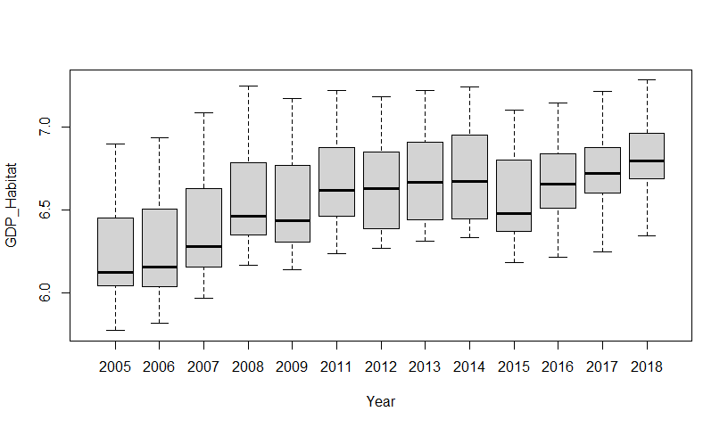<!-- -->


```r
scatterplot(POP_ACT ~ Year | Country_Name, boxplot = FALSE,
            smooth = TRUE, reg.line = TRUE, data = Data_UEMOA)
```

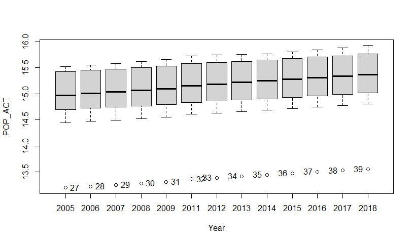<!-- -->

```
##  [1] "27" "28" "29" "30" "31" "32" "33" "34" "35" "36" "37" "38" "39"
```


```r
scatterplot(INPRIV ~ Year | Country_Name, boxplot = FALSE,
            smooth = TRUE, reg.line = TRUE, data = Data_UEMOA)
```

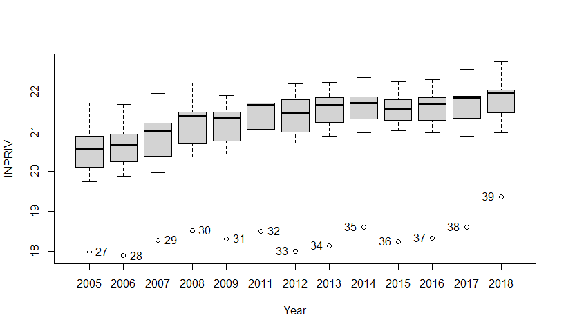<!-- -->

```
##  [1] "27" "28" "29" "30" "31" "32" "33" "34" "35" "36" "37" "38" "39"
```


```r
scatterplot(EPARBRUT ~ Year | Country_Name, boxplot = FALSE,
            smooth = TRUE, reg.line = TRUE, data = Data_UEMOA)
```

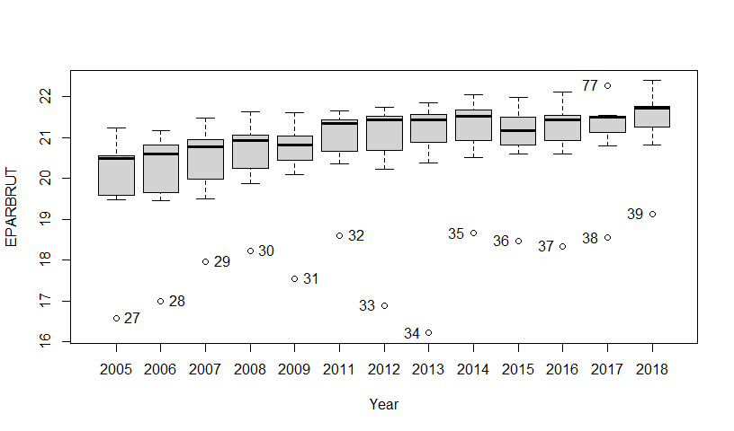<!-- -->

```
##  [1] "27" "28" "29" "30" "31" "32" "33" "34" "35" "36" "37" "38" "77" "39"
```


```r
scatterplot(DEBTEXT ~ Year | Country_Name, boxplot = FALSE,
            smooth = TRUE, reg.line = TRUE, data = Data_UEMOA)
```

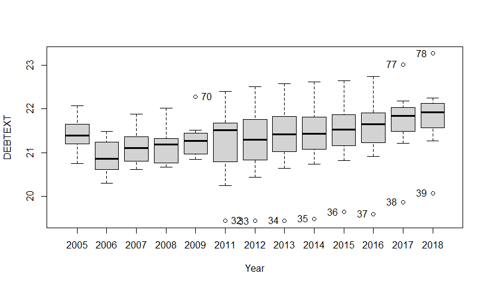<!-- -->

```
##  [1] "70" "32" "33" "34" "35" "36" "37" "38" "77" "39" "78"
```


```r
scatterplot(DEPUB ~ Year | Country_Name, boxplot = FALSE,
            smooth = TRUE, reg.line = TRUE, data = Data_UEMOA)
```

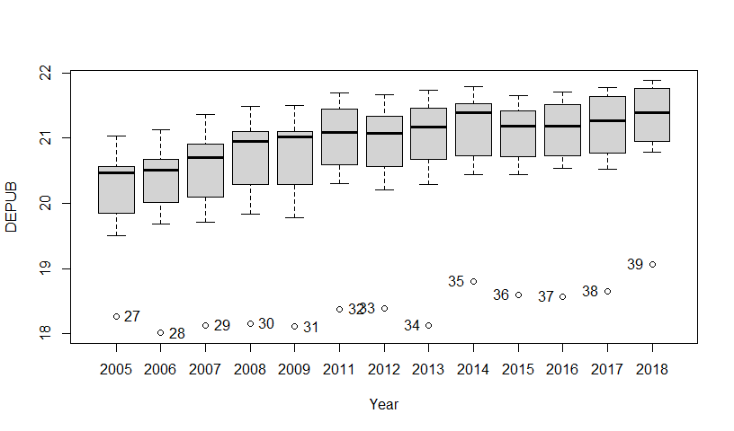<!-- -->

```
##  [1] "27" "28" "29" "30" "31" "32" "33" "34" "35" "36" "37" "38" "39"
```

### 5.2 BRICS Countries


```r
stargazer(Data_BRICS, title="Descriptive Statistic ", type = "text")
```

```
## 
## Descriptive Statistic
## ============================================
## Statistic   N   Mean  St. Dev.  Min    Max  
## --------------------------------------------
## GDP_Habitat 65 8.578   0.825   6.572  9.679 
## POP_ACT     65 18.751  1.328   16.736 20.499
## INPRIV      65 26.761  1.296   24.607 29.437
## EPARBRUT    65 26.745  1.365   24.557 29.453
## DEBTEXT     65 26.567  0.838   24.469 28.305
## DEPUB       65 26.270  1.001   24.566 28.463
## --------------------------------------------
```

**Boxplots**


```r
scatterplot(GDP_Habitat ~ Year | Country_Name, boxplot = FALSE,
            smooth = TRUE, reg.line = TRUE, data = Data_BRICS)
```

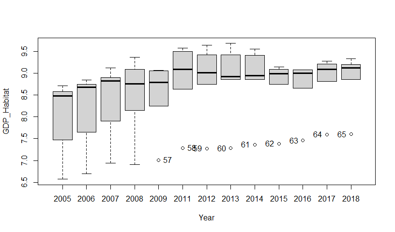<!-- -->

```
## [1] "57" "58" "59" "60" "61" "62" "63" "64" "65"
```


```r
scatterplot(POP_ACT ~ Year | Country_Name, boxplot = FALSE,
            smooth = TRUE, reg.line = TRUE, data = Data_BRICS)
```

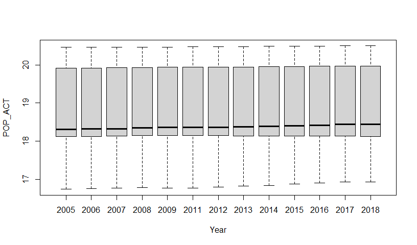<!-- -->


```r
scatterplot(INPRIV ~ Year | Country_Name, boxplot = FALSE,
            smooth = TRUE, reg.line = TRUE, data = Data_BRICS)
```

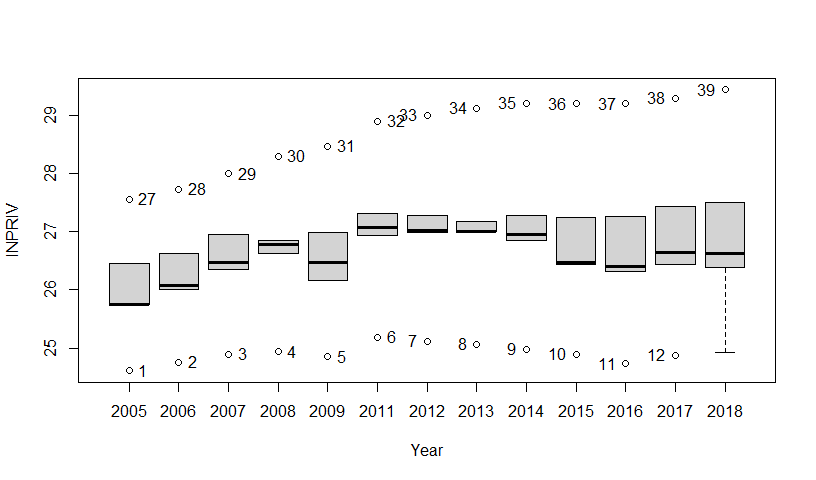<!-- -->

```
##  [1] "1"  "27" "2"  "28" "3"  "29" "4"  "30" "5"  "31" "6"  "32" "7"  "33" "8" 
## [16] "34" "9"  "35" "10" "36" "11" "37" "12" "38" "39"
```


```r
scatterplot(EPARBRUT ~ Year | Country_Name, boxplot = FALSE,
            smooth = TRUE, reg.line = TRUE, data = Data_BRICS)
```

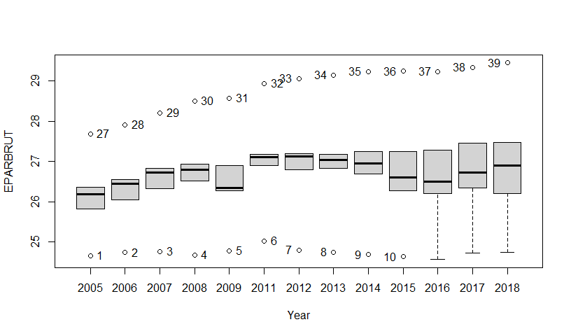<!-- -->

```
##  [1] "1"  "27" "2"  "28" "3"  "29" "4"  "30" "5"  "31" "6"  "32" "7"  "33" "8" 
## [16] "34" "9"  "35" "10" "36" "37" "38" "39"
```


```r
scatterplot(DEBTEXT ~ Year | Country_Name, boxplot = FALSE,
            smooth = TRUE, reg.line = TRUE, data = Data_BRICS)
```

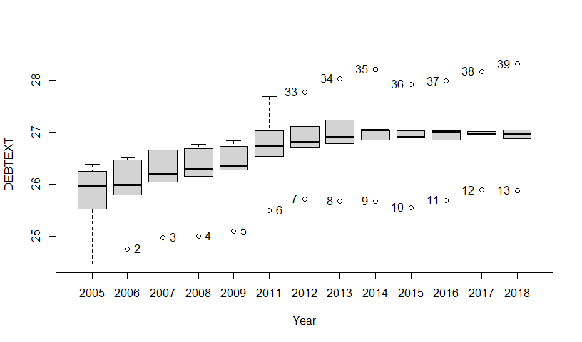<!-- -->

```
##  [1] "2"  "3"  "4"  "5"  "6"  "7"  "33" "8"  "34" "9"  "35" "10" "36" "11" "37"
## [16] "12" "38" "13" "39"
```


```r
scatterplot(DEPUB ~ Year | Country_Name, boxplot = FALSE,
            smooth = TRUE, reg.line = TRUE, data = Data_BRICS)
```

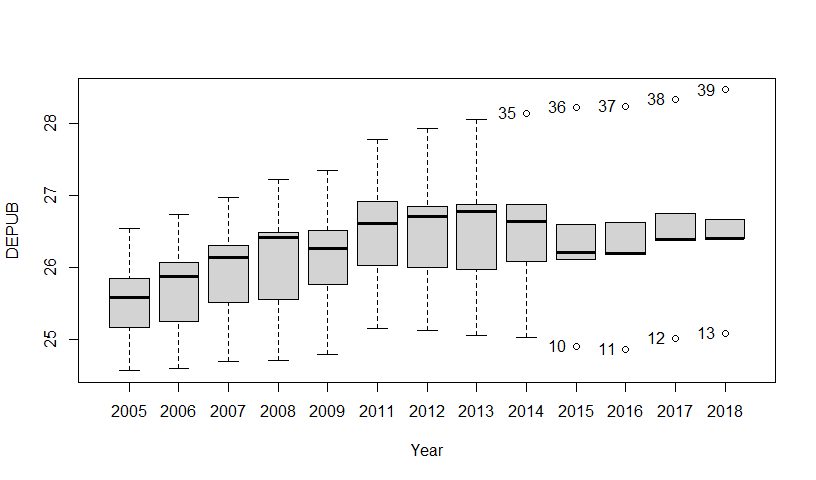<!-- -->

```
## [1] "35" "10" "36" "11" "37" "12" "38" "13" "39"
```

## 6. Model Specification OLS, Within, First difference, GLS

### 6.1 WAEMU Countries

We are going to regress economic growth per capita on the private investment,labor force, gross savings,public expenditure and public debts of the country. Model estimation using the `lm()` function


```r
reg1 <- lm(data = Data_UEMOA, GDP_Habitat ~ factor(Code) + POP_ACT + INPRIV + EPARBRUT + DEPUB + DEBTEXT)
summary(reg1)
```

```
## 
## Call:
## lm(formula = GDP_Habitat ~ factor(Code) + POP_ACT + INPRIV + 
##     EPARBRUT + DEPUB + DEBTEXT, data = Data_UEMOA)
## 
## Residuals:
##       Min        1Q    Median        3Q       Max 
## -0.202822 -0.052381  0.000519  0.048939  0.183014 
## 
## Coefficients:
##               Estimate Std. Error t value Pr(>|t|)    
## (Intercept)   -2.21183    1.63424  -1.353  0.17978    
## factor(Code)2 -0.64825    0.06838  -9.480 1.13e-14 ***
## factor(Code)3  0.61907    0.19276   3.212  0.00191 ** 
## factor(Code)4 -0.58003    0.05865  -9.889 1.81e-15 ***
## factor(Code)5 -0.92681    0.09049 -10.242 3.76e-16 ***
## factor(Code)6 -0.17742    0.07421  -2.391  0.01919 *  
## factor(Code)7 -0.29224    0.07042  -4.150 8.32e-05 ***
## POP_ACT       -0.02172    0.17679  -0.123  0.90254    
## INPRIV         0.14756    0.05537   2.665  0.00933 ** 
## EPARBRUT       0.01666    0.03015   0.553  0.58200    
## DEPUB          0.34247    0.06907   4.958 3.99e-06 ***
## DEBTEXT       -0.05145    0.02100  -2.451  0.01647 *  
## ---
## Signif. codes:  0 '***' 0.001 '**' 0.01 '*' 0.05 '.' 0.1 ' ' 1
## 
## Residual standard error: 0.07707 on 79 degrees of freedom
## Multiple R-squared:  0.9631,	Adjusted R-squared:  0.958 
## F-statistic: 187.5 on 11 and 79 DF,  p-value: < 2.2e-16
```

Using `plm`, we can estimate the within model. Numerically equivalent to fixed effects.


```r
within_reg1 = plm(GDP_Habitat ~ POP_ACT + INPRIV + EPARBRUT + DEPUB + DEBTEXT, data=Data_UEMOA, model="within")
summary(within_reg1)
```

```
## Oneway (individual) effect Within Model
## 
## Call:
## plm(formula = GDP_Habitat ~ POP_ACT + INPRIV + EPARBRUT + DEPUB + 
##     DEBTEXT, data = Data_UEMOA, model = "within")
## 
## Balanced Panel: n = 7, T = 13, N = 91
## 
## Residuals:
##        Min.     1st Qu.      Median     3rd Qu.        Max. 
## -0.20282222 -0.05238115  0.00051904  0.04893916  0.18301378 
## 
## Coefficients:
##           Estimate Std. Error t-value  Pr(>|t|)    
## POP_ACT  -0.021719   0.176792 -0.1228  0.902538    
## INPRIV    0.147559   0.055367  2.6651  0.009329 ** 
## EPARBRUT  0.016665   0.030149  0.5527  0.582000    
## DEPUB     0.342471   0.069072  4.9582 3.986e-06 ***
## DEBTEXT  -0.051450   0.020995 -2.4506  0.016473 *  
## ---
## Signif. codes:  0 '***' 0.001 '**' 0.01 '*' 0.05 '.' 0.1 ' ' 1
## 
## Total Sum of Squares:    2.8804
## Residual Sum of Squares: 0.46919
## R-Squared:      0.83711
## Adj. R-Squared: 0.81443
## F-statistic: 81.1983 on 5 and 79 DF, p-value: < 2.22e-16
```

#Estimate the within model with two effects individuals and times


```r
within_reg1.tways = plm(GDP_Habitat ~ POP_ACT + INPRIV + EPARBRUT + DEPUB + DEBTEXT, data=Data_UEMOA, model="within", effect="twoways")
summary(within_reg1.tways)
```

```
## Twoways effects Within Model
## 
## Call:
## plm(formula = GDP_Habitat ~ POP_ACT + INPRIV + EPARBRUT + DEPUB + 
##     DEBTEXT, data = Data_UEMOA, effect = "twoways", model = "within")
## 
## Balanced Panel: n = 7, T = 13, N = 91
## 
## Residuals:
##       Min.    1st Qu.     Median    3rd Qu.       Max. 
## -0.1598559 -0.0321443 -0.0076563  0.0296616  0.1753182 
## 
## Coefficients:
##           Estimate Std. Error t-value  Pr(>|t|)    
## POP_ACT   0.601076   0.415293  1.4474 0.1524605    
## INPRIV   -0.010260   0.051146 -0.2006 0.8416122    
## EPARBRUT  0.050435   0.026327  1.9157 0.0596716 .  
## DEPUB     0.221908   0.063567  3.4910 0.0008565 ***
## DEBTEXT  -0.032157   0.019181 -1.6765 0.0983034 .  
## ---
## Signif. codes:  0 '***' 0.001 '**' 0.01 '*' 0.05 '.' 0.1 ' ' 1
## 
## Total Sum of Squares:    0.36923
## Residual Sum of Squares: 0.25599
## R-Squared:      0.30671
## Adj. R-Squared: 0.068712
## F-statistic: 5.92806 on 5 and 67 DF, p-value: 0.00013504
```

#Estimate the pooling model


```r
pooling_reg1 = plm(GDP_Habitat ~ POP_ACT + INPRIV + EPARBRUT + DEPUB + DEBTEXT, data=Data_UEMOA, model="pooling")
summary(pooling_reg1)
```

```
## Pooling Model
## 
## Call:
## plm(formula = GDP_Habitat ~ POP_ACT + INPRIV + EPARBRUT + DEPUB + 
##     DEBTEXT, data = Data_UEMOA, model = "pooling")
## 
## Balanced Panel: n = 7, T = 13, N = 91
## 
## Residuals:
##      Min.   1st Qu.    Median   3rd Qu.      Max. 
## -0.428818 -0.100652 -0.029487  0.068632  0.414128 
## 
## Coefficients:
##              Estimate Std. Error  t-value  Pr(>|t|)    
## (Intercept)  5.672697   0.707391   8.0192 5.180e-12 ***
## POP_ACT     -0.863381   0.071732 -12.0361 < 2.2e-16 ***
## INPRIV       0.112853   0.126092   0.8950    0.3733    
## EPARBRUT     0.086569   0.071471   1.2113    0.2292    
## DEPUB        0.536881   0.126192   4.2545 5.364e-05 ***
## DEBTEXT     -0.063313   0.048957  -1.2932    0.1994    
## ---
## Signif. codes:  0 '***' 0.001 '**' 0.01 '*' 0.05 '.' 0.1 ' ' 1
## 
## Total Sum of Squares:    12.719
## Residual Sum of Squares: 3.4344
## R-Squared:      0.72998
## Adj. R-Squared: 0.7141
## F-statistic: 45.958 on 5 and 85 DF, p-value: < 2.22e-16
```

We can also estimate the first difference model.


```r
fd_reg1 = plm(GDP_Habitat ~ POP_ACT + INPRIV + EPARBRUT + DEPUB + DEBTEXT, data=Data_UEMOA, model="fd")
summary(fd_reg1)
```

```
## Oneway (individual) effect First-Difference Model
## 
## Call:
## plm(formula = GDP_Habitat ~ POP_ACT + INPRIV + EPARBRUT + DEPUB + 
##     DEBTEXT, data = Data_UEMOA, model = "fd")
## 
## Balanced Panel: n = 7, T = 13, N = 91
## Observations used in estimation: 84
## 
## Residuals:
##       Min.    1st Qu.     Median    3rd Qu.       Max. 
## -0.2092616 -0.0319824  0.0053161  0.0310134  0.3252831 
## 
## Coefficients:
##               Estimate Std. Error t-value  Pr(>|t|)    
## (Intercept)  0.0017952  0.0253320  0.0709 0.9436837    
## POP_ACT      0.3879173  0.8348414  0.4647 0.6434696    
## INPRIV       0.2232222  0.0606219  3.6822 0.0004242 ***
## EPARBRUT    -0.0069678  0.0258885 -0.2691 0.7885265    
## DEPUB        0.1371130  0.0704656  1.9458 0.0552794 .  
## DEBTEXT     -0.0132067  0.0272995 -0.4838 0.6299048    
## ---
## Signif. codes:  0 '***' 0.001 '**' 0.01 '*' 0.05 '.' 0.1 ' ' 1
## 
## Total Sum of Squares:    0.72803
## Residual Sum of Squares: 0.44331
## R-Squared:      0.39109
## Adj. R-Squared: 0.35205
## F-statistic: 10.0194 on 5 and 78 DF, p-value: 1.9709e-07
```

#### Fisher Test : Tests for individual and/or time effects

Before estimating the random effects model, we will check for the presence or absence of individual or time effects in our model using Fisher's test; we can also do this using the Breush-Pagan test, but it is the same thing.


```r
# The assumption of no individuals and times effects
pFtest(within_reg1.tways, pooling_reg1) 
```

```
## 
## 	F test for twoways effects
## 
## data:  GDP_Habitat ~ POP_ACT + INPRIV + EPARBRUT + DEPUB + DEBTEXT
## F = 46.217, df1 = 18, df2 = 67, p-value < 2.2e-16
## alternative hypothesis: significant effects
```

The hypothesis of no individuals and times effects is strongly rejected with a p-value \< 2.2e-16 at 5%.


```r
# The assumption of no times effects, but assuming that there are individuals effects
pFtest(within_reg1.tways, within_reg1)
```

```
## 
## 	F test for twoways effects
## 
## data:  GDP_Habitat ~ POP_ACT + INPRIV + EPARBRUT + DEPUB + DEBTEXT
## F = 4.6503, df1 = 12, df2 = 67, p-value = 1.915e-05
## alternative hypothesis: significant effects
```

The hypothesis of no times effects, but assuming that there are individuals effects is strongly rejected with a p-value = 1.915e-05 at 5%. So the best within model is the model with two effects : individuals and times effects.

We can also estimate the random effect model with two effects.


```r
re_reg1 = plm(GDP_Habitat ~ POP_ACT + INPRIV + EPARBRUT + DEPUB + DEBTEXT, data=Data_UEMOA, effect="twoways", model="random")
summary(re_reg1)
```

```
## Twoways effects Random Effect Model 
##    (Swamy-Arora's transformation)
## 
## Call:
## plm(formula = GDP_Habitat ~ POP_ACT + INPRIV + EPARBRUT + DEPUB + 
##     DEBTEXT, data = Data_UEMOA, effect = "twoways", model = "random")
## 
## Balanced Panel: n = 7, T = 13, N = 91
## 
## Effects:
##                     var   std.dev share
## idiosyncratic 0.0038207 0.0618118 0.119
## individual    0.0278737 0.1669541 0.870
## time          0.0003416 0.0184826 0.011
## theta: 0.8979 (id) 0.2157 (time) 0.2154 (total)
## 
## Residuals:
##       Min.    1st Qu.     Median    3rd Qu.       Max. 
## -0.1866743 -0.0500187 -0.0048839  0.0422555  0.2715654 
## 
## Coefficients:
##              Estimate Std. Error z-value  Pr(>|z|)    
## (Intercept)  2.004790   1.229334  1.6308 0.1029339    
## POP_ACT     -0.450569   0.130686 -3.4477 0.0005653 ***
## INPRIV       0.151078   0.057312  2.6361 0.0083870 ** 
## EPARBRUT     0.026140   0.031262  0.8361 0.4030707    
## DEPUB        0.415021   0.067569  6.1422 8.139e-10 ***
## DEBTEXT     -0.043346   0.022022 -1.9683 0.0490390 *  
## ---
## Signif. codes:  0 '***' 0.001 '**' 0.01 '*' 0.05 '.' 0.1 ' ' 1
## 
## Total Sum of Squares:    2.0164
## Residual Sum of Squares: 0.52703
## R-Squared:      0.73863
## Adj. R-Squared: 0.72326
## Chisq: 240.21 on 5 DF, p-value: < 2.22e-16
```

### 6.2 BRICS Countries

Model estimation using the `lm()` function


```r
reg2 <- lm(data = Data_BRICS, GDP_Habitat ~ factor(Code) + POP_ACT + INPRIV + EPARBRUT + DEPUB + DEBTEXT)
summary(reg2)
```

```
## 
## Call:
## lm(formula = GDP_Habitat ~ factor(Code) + POP_ACT + INPRIV + 
##     EPARBRUT + DEPUB + DEBTEXT, data = Data_BRICS)
## 
## Residuals:
##       Min        1Q    Median        3Q       Max 
## -0.064469 -0.018976 -0.004111  0.016294  0.075433 
## 
## Coefficients:
##               Estimate Std. Error t value Pr(>|t|)    
## (Intercept)   -5.49092    2.75389  -1.994  0.05113 .  
## factor(Code)2 -0.47949    0.26274  -1.825  0.07345 .  
## factor(Code)3 -1.39601    0.63969  -2.182  0.03337 *  
## factor(Code)4 -0.36642    0.22669  -1.616  0.11173    
## factor(Code)5 -1.31490    0.54611  -2.408  0.01943 *  
## POP_ACT       -0.53181    0.16831  -3.160  0.00257 ** 
## INPRIV         0.08721    0.05376   1.622  0.11048    
## EPARBRUT       0.23014    0.05342   4.308 6.85e-05 ***
## DEPUB          0.67563    0.05685  11.884  < 2e-16 ***
## DEBTEXT       -0.05591    0.02834  -1.973  0.05354 .  
## ---
## Signif. codes:  0 '***' 0.001 '**' 0.01 '*' 0.05 '.' 0.1 ' ' 1
## 
## Residual standard error: 0.02977 on 55 degrees of freedom
## Multiple R-squared:  0.9989,	Adjusted R-squared:  0.9987 
## F-statistic:  5460 on 9 and 55 DF,  p-value: < 2.2e-16
```

Using `plm`, we can estimate the within model. Numerically equivalent to fixed effects.


```r
within_reg2 = plm(GDP_Habitat ~ POP_ACT + INPRIV + EPARBRUT + DEPUB + DEBTEXT, data=Data_BRICS, model="within")
summary(within_reg2)
```

```
## Oneway (individual) effect Within Model
## 
## Call:
## plm(formula = GDP_Habitat ~ POP_ACT + INPRIV + EPARBRUT + DEPUB + 
##     DEBTEXT, data = Data_BRICS, model = "within")
## 
## Balanced Panel: n = 5, T = 13, N = 65
## 
## Residuals:
##       Min.    1st Qu.     Median    3rd Qu.       Max. 
## -0.0644685 -0.0189756 -0.0041114  0.0162940  0.0754326 
## 
## Coefficients:
##           Estimate Std. Error t-value  Pr(>|t|)    
## POP_ACT  -0.531808   0.168310 -3.1597  0.002567 ** 
## INPRIV    0.087209   0.053759  1.6222  0.110476    
## EPARBRUT  0.230145   0.053418  4.3083 6.848e-05 ***
## DEPUB     0.675627   0.056852 11.8840 < 2.2e-16 ***
## DEBTEXT  -0.055907   0.028337 -1.9729  0.053541 .  
## ---
## Signif. codes:  0 '***' 0.001 '**' 0.01 '*' 0.05 '.' 0.1 ' ' 1
## 
## Total Sum of Squares:    7.852
## Residual Sum of Squares: 0.048731
## R-Squared:      0.99379
## Adj. R-Squared: 0.99278
## F-statistic: 1761.43 on 5 and 55 DF, p-value: < 2.22e-16
```

#Estimate the within model with two effects individuals and times


```r
within_reg2.tways = plm(GDP_Habitat ~ POP_ACT + INPRIV + EPARBRUT + DEPUB + DEBTEXT, data=Data_BRICS, model="within", effect="twoways")
summary(within_reg2.tways)
```

```
## Twoways effects Within Model
## 
## Call:
## plm(formula = GDP_Habitat ~ POP_ACT + INPRIV + EPARBRUT + DEPUB + 
##     DEBTEXT, data = Data_BRICS, effect = "twoways", model = "within")
## 
## Balanced Panel: n = 5, T = 13, N = 65
## 
## Residuals:
##       Min.    1st Qu.     Median    3rd Qu.       Max. 
## -0.0560861 -0.0158279 -0.0015887  0.0163901  0.0654606 
## 
## Coefficients:
##           Estimate Std. Error t-value  Pr(>|t|)    
## POP_ACT  -0.495199   0.194909 -2.5407  0.014756 *  
## INPRIV    0.114563   0.068713  1.6673  0.102732    
## EPARBRUT  0.175403   0.062152  2.8222  0.007194 ** 
## DEPUB     0.743453   0.071560 10.3893 2.674e-13 ***
## DEBTEXT  -0.088975   0.036617 -2.4299  0.019353 *  
## ---
## Signif. codes:  0 '***' 0.001 '**' 0.01 '*' 0.05 '.' 0.1 ' ' 1
## 
## Total Sum of Squares:    2.6388
## Residual Sum of Squares: 0.040473
## R-Squared:      0.98466
## Adj. R-Squared: 0.97717
## F-statistic: 552.099 on 5 and 43 DF, p-value: < 2.22e-16
```

#Estimate the pooling model


```r
pooling_reg2 = plm(GDP_Habitat ~ POP_ACT + INPRIV + EPARBRUT + DEPUB + DEBTEXT, data=Data_BRICS, model="pooling")
summary(pooling_reg2)
```

```
## Pooling Model
## 
## Call:
## plm(formula = GDP_Habitat ~ POP_ACT + INPRIV + EPARBRUT + DEPUB + 
##     DEBTEXT, data = Data_BRICS, model = "pooling")
## 
## Balanced Panel: n = 5, T = 13, N = 65
## 
## Residuals:
##       Min.    1st Qu.     Median    3rd Qu.       Max. 
## -0.0812670 -0.0290596 -0.0057523  0.0274513  0.0940382 
## 
## Coefficients:
##              Estimate Std. Error  t-value  Pr(>|t|)    
## (Intercept) -0.162471   0.191334  -0.8492    0.3992    
## POP_ACT     -0.924603   0.013957 -66.2460 < 2.2e-16 ***
## INPRIV      -0.247066   0.043432  -5.6886 4.224e-07 ***
## EPARBRUT     0.414164   0.035014  11.8284 < 2.2e-16 ***
## DEPUB        0.860926   0.023669  36.3729 < 2.2e-16 ***
## DEBTEXT     -0.037778   0.017455  -2.1643    0.0345 *  
## ---
## Signif. codes:  0 '***' 0.001 '**' 0.01 '*' 0.05 '.' 0.1 ' ' 1
## 
## Total Sum of Squares:    43.586
## Residual Sum of Squares: 0.10441
## R-Squared:      0.9976
## Adj. R-Squared: 0.9974
## F-statistic: 4914.06 on 5 and 59 DF, p-value: < 2.22e-16
```

We can also estimate the first difference model.


```r
fd_reg2 = plm(GDP_Habitat ~ POP_ACT + INPRIV + EPARBRUT + DEPUB + DEBTEXT, data=Data_BRICS, model="fd")
summary(fd_reg2)
```

```
## Oneway (individual) effect First-Difference Model
## 
## Call:
## plm(formula = GDP_Habitat ~ POP_ACT + INPRIV + EPARBRUT + DEPUB + 
##     DEBTEXT, data = Data_BRICS, model = "fd")
## 
## Balanced Panel: n = 5, T = 13, N = 65
## Observations used in estimation: 60
## 
## Residuals:
##       Min.    1st Qu.     Median    3rd Qu.       Max. 
## -0.0516807 -0.0086925  0.0043847  0.0129176  0.0366623 
## 
## Coefficients:
##               Estimate Std. Error t-value  Pr(>|t|)    
## (Intercept) -0.0059569  0.0039858 -1.4945   0.14086    
## POP_ACT     -0.1179510  0.2775836 -0.4249   0.67258    
## INPRIV       0.1020995  0.0445142  2.2936   0.02573 *  
## EPARBRUT     0.2435744  0.0380319  6.4045 3.806e-08 ***
## DEPUB        0.6049780  0.0398576 15.1785 < 2.2e-16 ***
## DEBTEXT      0.0050261  0.0195344  0.2573   0.79793    
## ---
## Signif. codes:  0 '***' 0.001 '**' 0.01 '*' 0.05 '.' 0.1 ' ' 1
## 
## Total Sum of Squares:    1.6682
## Residual Sum of Squares: 0.019228
## R-Squared:      0.98847
## Adj. R-Squared: 0.98741
## F-statistic: 926.192 on 5 and 54 DF, p-value: < 2.22e-16
```

#### Fisher Test : Tests for individual and/or time effects

Before estimating the random effects model, we will check for the presence or absence of individual or time effects in our model using Fisher's test; we can also do this using the Breush-Pagan test, but it is the same thing.


```r
# The assumption of no individuals and times effects
pFtest(within_reg2.tways, pooling_reg2) 
```

```
## 
## 	F test for twoways effects
## 
## data:  GDP_Habitat ~ POP_ACT + INPRIV + EPARBRUT + DEPUB + DEBTEXT
## F = 4.2455, df1 = 16, df2 = 43, p-value = 7.678e-05
## alternative hypothesis: significant effects
```

The hypothesis of no individuals and times effects is strongly rejected with a p-value \< 7.678e-05 at 5%.


```r
# The assumption of no times effects, but assuming that there are individuals effects
pFtest(within_reg2.tways, within_reg2)
```

```
## 
## 	F test for twoways effects
## 
## data:  GDP_Habitat ~ POP_ACT + INPRIV + EPARBRUT + DEPUB + DEBTEXT
## F = 0.7311, df1 = 12, df2 = 43, p-value = 0.7135
## alternative hypothesis: significant effects
```

The hypothesis of no times effects, but assuming that there are individuals effects is not rejected with a p-value = 0.7135 at 5%. So the best within model is the model with only individuals effects.


```r
within_reg2.ind = plm(GDP_Habitat ~ POP_ACT + INPRIV + EPARBRUT + DEPUB + DEBTEXT, data=Data_BRICS, model="within", effect="individual")
summary(within_reg2.ind)
```

```
## Oneway (individual) effect Within Model
## 
## Call:
## plm(formula = GDP_Habitat ~ POP_ACT + INPRIV + EPARBRUT + DEPUB + 
##     DEBTEXT, data = Data_BRICS, effect = "individual", model = "within")
## 
## Balanced Panel: n = 5, T = 13, N = 65
## 
## Residuals:
##       Min.    1st Qu.     Median    3rd Qu.       Max. 
## -0.0644685 -0.0189756 -0.0041114  0.0162940  0.0754326 
## 
## Coefficients:
##           Estimate Std. Error t-value  Pr(>|t|)    
## POP_ACT  -0.531808   0.168310 -3.1597  0.002567 ** 
## INPRIV    0.087209   0.053759  1.6222  0.110476    
## EPARBRUT  0.230145   0.053418  4.3083 6.848e-05 ***
## DEPUB     0.675627   0.056852 11.8840 < 2.2e-16 ***
## DEBTEXT  -0.055907   0.028337 -1.9729  0.053541 .  
## ---
## Signif. codes:  0 '***' 0.001 '**' 0.01 '*' 0.05 '.' 0.1 ' ' 1
## 
## Total Sum of Squares:    7.852
## Residual Sum of Squares: 0.048731
## R-Squared:      0.99379
## Adj. R-Squared: 0.99278
## F-statistic: 1761.43 on 5 and 55 DF, p-value: < 2.22e-16
```

We can also estimate the random effect model. we can't use swar default random.method of error components model because the numbers of parameters included intercept is greater than the number of individus so we use the Amemiya random method with 3 degree of freedom which means that the unbiased version of the estimation of the error components is used.


```r
re_reg2 = plm(GDP_Habitat ~ POP_ACT + INPRIV + EPARBRUT + DEPUB + DEBTEXT, data=Data_BRICS,model="random", effect="individual",
              random.method = "amemiya", random.dfcor = 3)
summary(re_reg2)
```

```
## Oneway (individual) effect Random Effect Model 
##    (Amemiya's transformation)
## 
## Call:
## plm(formula = GDP_Habitat ~ POP_ACT + INPRIV + EPARBRUT + DEPUB + 
##     DEBTEXT, data = Data_BRICS, effect = "individual", model = "random", 
##     random.method = "amemiya", random.dfcor = 3)
## 
## Balanced Panel: n = 5, T = 13, N = 65
## 
## Effects:
##                    var  std.dev share
## idiosyncratic 0.000886 0.029766 0.003
## individual    0.310856 0.557544 0.997
## theta: 0.9852
## 
## Residuals:
##       Min.    1st Qu.     Median    3rd Qu.       Max. 
## -0.0705469 -0.0141874 -0.0064036  0.0138987  0.0793252 
## 
## Coefficients:
##              Estimate Std. Error z-value  Pr(>|z|)    
## (Intercept) -2.854595   2.258864 -1.2637    0.2063    
## POP_ACT     -0.714164   0.122536 -5.8282 5.603e-09 ***
## INPRIV       0.079459   0.052927  1.5013    0.1333    
## EPARBRUT     0.215768   0.052007  4.1488 3.342e-05 ***
## DEPUB        0.686626   0.055755 12.3150 < 2.2e-16 ***
## DEBTEXT     -0.041808   0.026563 -1.5739    0.1155    
## ---
## Signif. codes:  0 '***' 0.001 '**' 0.01 '*' 0.05 '.' 0.1 ' ' 1
## 
## Total Sum of Squares:    7.8598
## Residual Sum of Squares: 0.051088
## R-Squared:      0.9935
## Adj. R-Squared: 0.99295
## Chisq: 9018.06 on 5 DF, p-value: < 2.22e-16
```

## 7. Summary of estimated models

### 7.1 WAEMU Countries


```r
stargazer(reg1, fd_reg1, pooling_reg1, within_reg1.tways, re_reg1,
          dep.var.caption="",dep.var.labels="GDP per Capita",
          model.numbers = FALSE,
          column.labels = c("OLS","First difference","Pooling","Within twoways","GLS"),
          omit.table.layout = "n", star.cutoffs = NA,keep.stat=c("rsq","n"),no.space=TRUE,
          header=FALSE,
          keep=c("POP_ACT","INPRIV","EPARBRUT","DEPUB","DEBTEXT"),
          title="Summary of estimated models", type="text"
)
```

```
## 
## Summary of estimated models
## ====================================================================
##                                  GDP per Capita                     
##                OLS                        panel                     
##                                          linear                     
##                OLS   First difference Pooling Within twoways   GLS  
## --------------------------------------------------------------------
## POP_ACT      -0.022       0.388       -0.863      0.601      -0.451 
##              (0.177)     (0.835)      (0.072)    (0.415)     (0.131)
## INPRIV        0.148       0.223        0.113      -0.010      0.151 
##              (0.055)     (0.061)      (0.126)    (0.051)     (0.057)
## EPARBRUT      0.017       -0.007       0.087      0.050       0.026 
##              (0.030)     (0.026)      (0.071)    (0.026)     (0.031)
## DEPUB         0.342       0.137        0.537      0.222       0.415 
##              (0.069)     (0.070)      (0.126)    (0.064)     (0.068)
## DEBTEXT      -0.051       -0.013      -0.063      -0.032     -0.043 
##              (0.021)     (0.027)      (0.049)    (0.019)     (0.022)
## --------------------------------------------------------------------
## Observations   91           84          91          91         91   
## R2            0.963       0.391        0.730      0.307       0.739 
## ====================================================================
```

### 7.2 BRICS Countries


```r
stargazer(reg2, fd_reg2, pooling_reg2, within_reg2.ind, re_reg2, 
          dep.var.caption="",dep.var.labels="GDP per Capita",
          model.numbers = FALSE,
          column.labels = c("OLS","First difference","Pooling","Within individuals", "GLS"),
          omit.table.layout = "n", star.cutoffs = NA,keep.stat=c("rsq","n"),no.space=TRUE,
          header=FALSE,
          keep=c("POP_ACT","INPRIV","EPARBRUT","DEPUB","DEBTEXT"),
          title="Summary of estimated models", type="text"
)
```

```
## 
## Summary of estimated models
## ========================================================================
##                                    GDP per Capita                       
##                OLS                          panel                       
##                                            linear                       
##                OLS   First difference Pooling Within individuals   GLS  
## ------------------------------------------------------------------------
## POP_ACT      -0.532       -0.118      -0.925        -0.532       -0.714 
##              (0.168)     (0.278)      (0.014)      (0.168)       (0.123)
## INPRIV        0.087       0.102       -0.247        0.087         0.079 
##              (0.054)     (0.045)      (0.043)      (0.054)       (0.053)
## EPARBRUT      0.230       0.244        0.414        0.230         0.216 
##              (0.053)     (0.038)      (0.035)      (0.053)       (0.052)
## DEPUB         0.676       0.605        0.861        0.676         0.687 
##              (0.057)     (0.040)      (0.024)      (0.057)       (0.056)
## DEBTEXT      -0.056       0.005       -0.038        -0.056       -0.042 
##              (0.028)     (0.020)      (0.017)      (0.028)       (0.027)
## ------------------------------------------------------------------------
## Observations   65           60          65            65           65   
## R2            0.999       0.988        0.998        0.994         0.994 
## ========================================================================
```

## 8. Hausman-Taylor Test

### 8.1 WAEMU Countries

Implementing a Hausman-Taylor test. Under the null hypothesis of no correlation between the regressors and the individual effects `cov(alpha_i,x_it)=0`, the statistics is distributed as a Chi-2 with fives degrees of freedom.This hypothesis, with a p-value of 3.268e-16 is rejected at the 5% confidence level. We therefore return the model with the fixed effects. In this case, the Within estimator is BLUE and better than the GLS estimator which is not consistent.


```r
phtest(within_reg1.tways,re_reg1)
```

```
## 
## 	Hausman Test
## 
## data:  GDP_Habitat ~ POP_ACT + INPRIV + EPARBRUT + DEPUB + DEBTEXT
## chisq = 81.957, df = 5, p-value = 3.268e-16
## alternative hypothesis: one model is inconsistent
```

### 8.2 BRICS Countries

Implementing a Hausman-Taylor test. Under the null hypothesis of no correlation between the regressors and the individual effects `cov(alpha_i,x_it)=0`, the statistics is distributed as a Chi-2 with fives degrees of freedom because 5 parameters without alpha_i.This hypothesis, with a p-value of 0.7752 is not rejected at the 5% confidence level. We therefore return the random effects/Error Component Model.


```r
phtest(within_reg2.ind,re_reg2)
```

```
## 
## 	Hausman Test
## 
## data:  GDP_Habitat ~ POP_ACT + INPRIV + EPARBRUT + DEPUB + DEBTEXT
## chisq = 2.5084, df = 5, p-value = 0.7752
## alternative hypothesis: one model is inconsistent
```

## Heteroscedasticity Test - Breush-Pagan Test

We performed the breush-Pagan test to test the presence of heteroscedasticity in the models retained in each group of countries. H0 : There is Homoscedasticity.

### WAEMU


```r
bptest(formula = within_reg1.tways , studentize = F)
```

```
## 
## 	Breusch-Pagan test
## 
## data:  within_reg1.tways
## BP = 25.462, df = 5, p-value = 0.0001135
```

This hypothesis, with p-value of 0.0001135 is rejected at the 5% confidence level. So there there is Heteroscedasticity in the fixed effect model.

### BRICS


```r
bptest(formula = re_reg2 , studentize = F)
```

```
## 
## 	Breusch-Pagan test
## 
## data:  re_reg2
## BP = 7.4313, df = 5, p-value = 0.1905
```

This hypothesis, with p-value of 0.1905 is not rejected at the 5% confidence level. So there there is Homoscedasticity in the random effect model.

## Autocorrelation Test/serial correlation Durbin-Watson Test & Breusch-Godfrey/Wooldridge Test

The test of autocorrelation of errors is only done on the random effects model. And as it is the model used in the BRICS countries. So we will do this test on the random effects model of the BRICS countries. For this we performed serial correlation of Durbin-Watson.

H0 : There is no Autocorrelation in error term.


```r
pdwtest(re_reg2)
```

```
## 
## 	Durbin-Watson test for serial correlation in panel models
## 
## data:  GDP_Habitat ~ POP_ACT + INPRIV + EPARBRUT + DEPUB + DEBTEXT
## DW = 0.63422, p-value = 8.188e-12
## alternative hypothesis: serial correlation in idiosyncratic errors
```

This hypothesis, with p-value of 0.0001135 is rejected at the 5% confidence level. So there there is Autocorrelation in error term of random effect model. This is perfectly normal as it is a spherical error model. To confirm this result. We performed Breusch-Godfrey/Wooldridge test for serial correlation in panel models. Which is test based on fixed effect model. And we have same result.


```r
pbgtest(within_reg2.ind)
```

```
## 
## 	Breusch-Godfrey/Wooldridge test for serial correlation in panel models
## 
## data:  GDP_Habitat ~ POP_ACT + INPRIV + EPARBRUT + DEPUB + DEBTEXT
## chisq = 37.435, df = 13, p-value = 0.0003539
## alternative hypothesis: serial correlation in idiosyncratic errors
```
